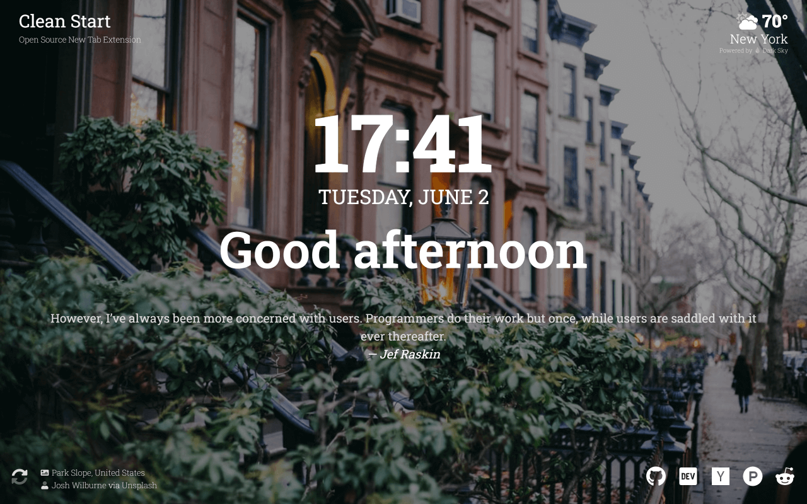
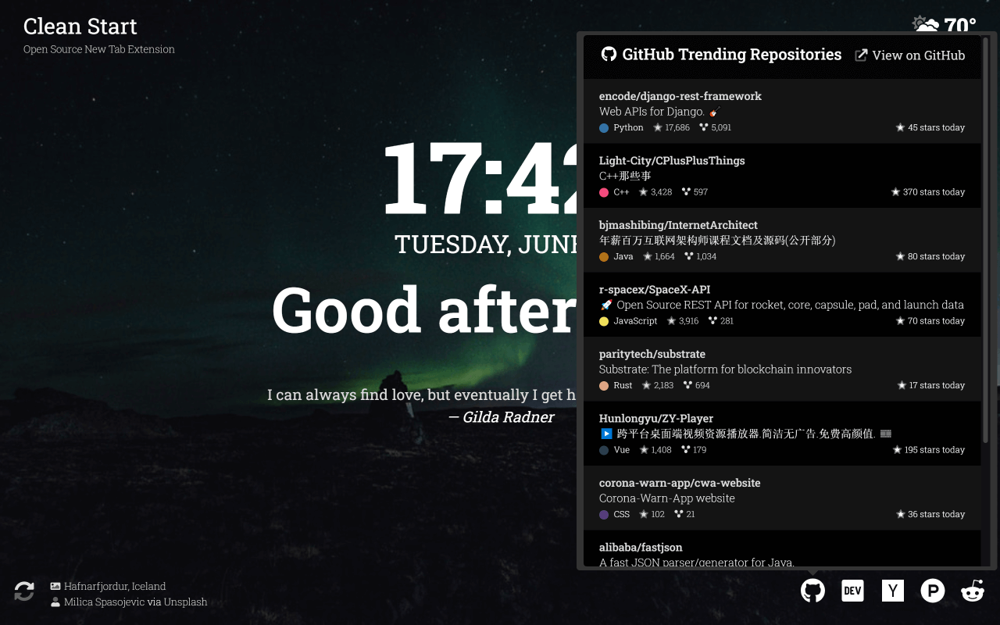
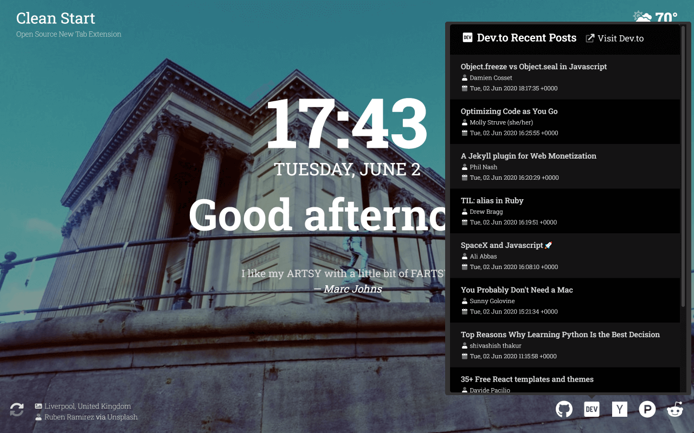
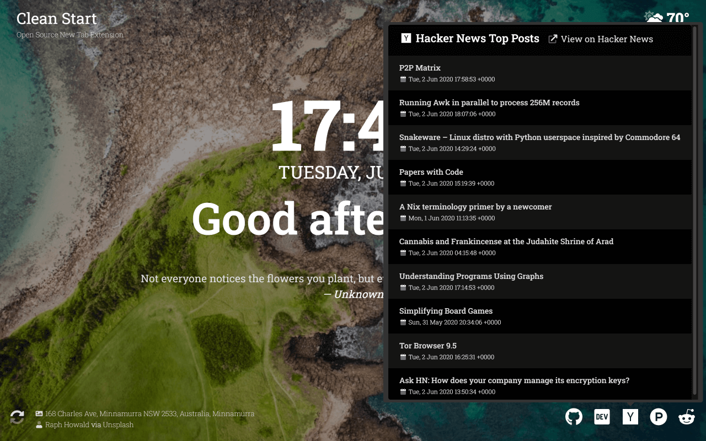
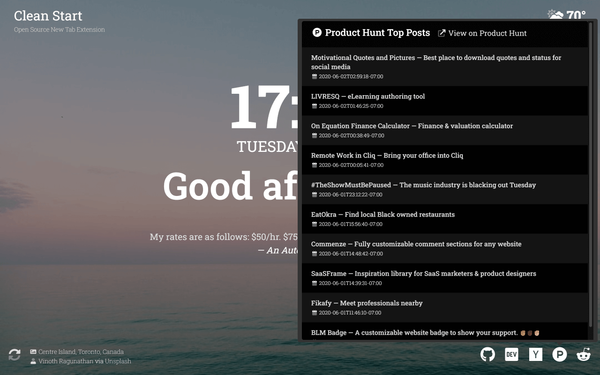
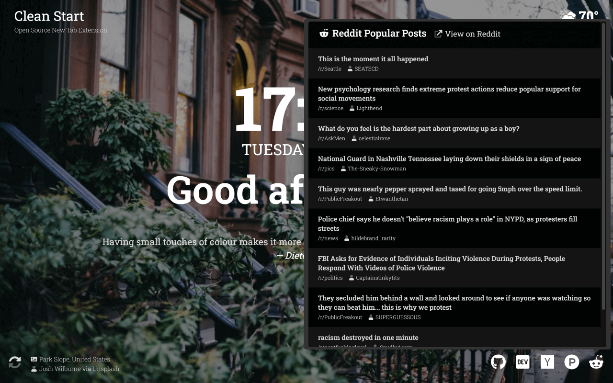

# Clean Start

Open source new tab extension

## Contents

- [About](#about)
- [Install](#install)
- [Build](#build)
- [Demo](#demo)
- [Screenshots](#screenshots)
- [Uses](#uses)
- [License](#license)

## About

- Layout/design based on what I liked from the Momentum browser extension
- Date and time with greeting
- Current temp/conditions (powered by [Dark Sky](https://darksky.net/poweredby/))
- Random quote (from [Quotes on Design API](https://quotesondesign.com/api/))
- Random background image (from [Unsplash API](https://unsplash.com/developers/))
- Top posts from some useful sites
  - [GitHub Trending Repositories](https://www.github.com/trending/)
  - [DEV Community Recent Posts](https://dev.to/)
  - [Hacker News Top Posts](https://news.ycombinator.com/)
  - [Product Hunt Top Posts](https://producthunt.com/)
  - [Reddit Popular Posts](https://www.reddit.com/r/popular)

## Install

- Chrome Store: [https://chrome.google.com/webstore/detail/mmnlbcjgkfloemcbbjhklbblhbcjhmol](https://chrome.google.com/webstore/detail/mmnlbcjgkfloemcbbjhklbblhbcjhmol)
- Firefox Add-ons: [https://addons.mozilla.org/en-US/firefox/addon/clean-start/](https://addons.mozilla.org/en-US/firefox/addon/clean-start/)

## Build

- Install dependencies `npm install`
- Build extension `npm run build:extension`
  - This will create a `public` folder with the extension files and an `extension.zip` file for submitting
- Run/develop locally `npm run dev`

NOTE: You will need API keys from Dark Sky, Unsplash, and Google Maps to build/run the Netlify functions this extension uses without modification

## Demo

Demo available as a progressive web app (PWA):

- [https://cleanst.art](https://cleanst.art)

## Screenshots

## Uses

- Demo hosting - [Netlify](https://www.netlify.com)
- Serveless functions used for backend API - [Netlify Functions](https://www.netlify.com/products/functions/)
- Dependency monitoring - [Snyk](https://github.com/snyk/snyk)
- Icons - [FontAwesome](https://fontawesome.com/)
- Font ([Roboto Slab](https://fonts.google.com/specimen/Roboto+Slab?query=roboto+slab)) - [Google Fonts](https://fonts.google.com/)
- Tooltips and content popups - [tippy.js](https://github.com/atomiks/tippyjs)
- Date/time lib - [dayjs](https://github.com/iamkun/dayjs)
- CSS framework (bc I am lazy) - [bootstrap](https://github.com/twbs/bootstrap)
  - NOTE: unused CSS bloat removed during webpack build
- HTTP lib/client - [axios](https://github.com/axios/axios/)
- Open source license compliance monitoring - [FOSSA](https://fossa.com/)

## License

MIT License

Copyright (c) 2020 Michael Sprague

Permission is hereby granted, free of charge, to any person obtaining a copy
of this software and associated documentation files (the "Software"), to deal
in the Software without restriction, including without limitation the rights
to use, copy, modify, merge, publish, distribute, sublicense, and/or sell
copies of the Software, and to permit persons to whom the Software is
furnished to do so, subject to the following conditions:

The above copyright notice and this permission notice shall be included in all
copies or substantial portions of the Software.

THE SOFTWARE IS PROVIDED "AS IS", WITHOUT WARRANTY OF ANY KIND, EXPRESS OR
IMPLIED, INCLUDING BUT NOT LIMITED TO THE WARRANTIES OF MERCHANTABILITY,
FITNESS FOR A PARTICULAR PURPOSE AND NONINFRINGEMENT. IN NO EVENT SHALL THE
AUTHORS OR COPYRIGHT HOLDERS BE LIABLE FOR ANY CLAIM, DAMAGES OR OTHER
LIABILITY, WHETHER IN AN ACTION OF CONTRACT, TORT OR OTHERWISE, ARISING FROM,
OUT OF OR IN CONNECTION WITH THE SOFTWARE OR THE USE OR OTHER DEALINGS IN THE
SOFTWARE.
